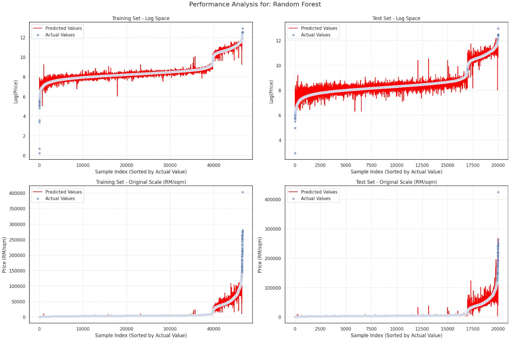
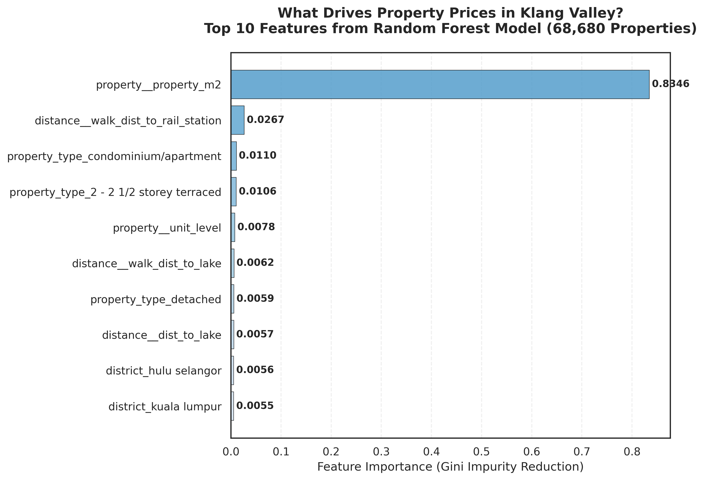
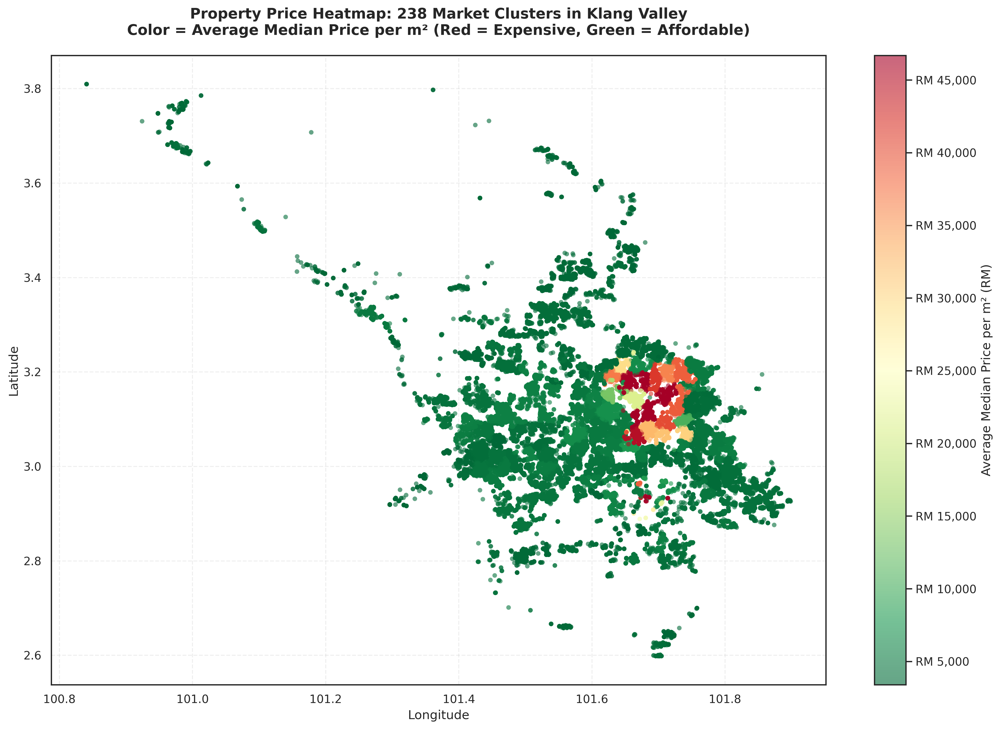
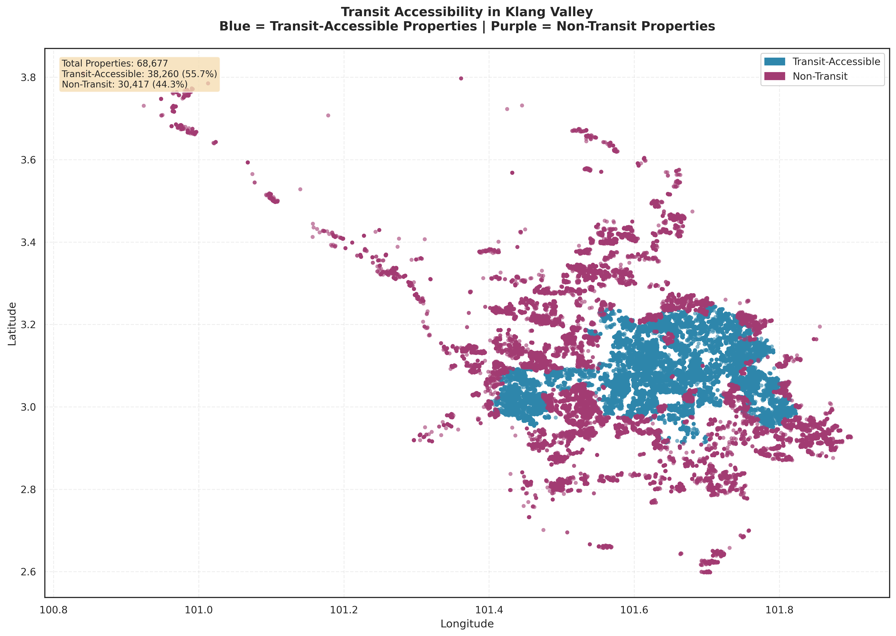

# 🏠 Predicting Property Prices in Klang Valley with 97% Accuracy
### End-to-End Machine Learning Pipeline for Automated Real Estate Valuation in Klang Valley, Malaysia

[](https://www.python.org/)
[](https://scikit-learn.org/)
[](LICENSE)

---

## 🚀 Quick Start for Recruiters

**What is this?** A machine learning system that predicts residential property prices in Malaysia's Klang Valley with **97% accuracy**, reducing valuation time from weeks to **minutes**.

**Key Innovation:** Automated feature engineering using OpenStreetMap data—extracting 22 location-based features and consolidating 18,000+ inconsistent road names into 238 meaningful market segments.

**Business Impact:** 
- ⚡ **Speed:** Weeks of manual research → Minutes of automated analysis
- 🎯 **Accuracy:** Predictions within ±16.32% of actual prices
- 💰 **Cost Savings:** Estimated RM 150,000/month for agencies processing 200+ valuations

**For Technical Details:** See [Technical Documentation](TECHNICAL.md)

**Best Notebook to Review:** [`5_Modelling.ipynb`](notebooks/5_Modelling.ipynb)

**Production Package:** [`src/`](src/) - Python package for automated pipelines and deployment

**Tech Stack:** Python • scikit-learn • Random Forest • Geospatial Analysis • OpenStreetMap

---

## 📸 Project at a Glance

<table>
  <tr>
    <td width="50%">
      
      <br/>
      <b>🎯 Model Accuracy:</b> Random Forest achieves 97% accuracy on future data (2025), with minimal prediction errors even for luxury properties
    </td>
    <td width="50%">
      
      <br/>
      <b>🔑 What Drives Prices:</b> Property size dominates (88%), followed by transit access (3%) and property type (1%)
    </td>
  </tr>
  <tr>
    <td width="50%">
      
      <br/>
      <b>🗺️ Market Segmentation:</b> Red zones (KLCC) average RM 45,000/m², green zones (suburbs) average RM 5,000/m²—an 8x price differential
    </td>
    <td width="50%">
      
      <br/>
      <b>🚇 Transit Premium:</b> 56% of properties are near rail stations (blue zones), commanding 15-20% price premiums
    </td>
  </tr>
</table>

**Key Takeaway:** This project demonstrates end-to-end machine learning—from messy real-world data to production-grade predictions with clear business insights.

---

## 🎯 The Business Problem

### Why Property Valuation Matters

Real estate agencies, investors, and financial institutions in Malaysia face a critical challenge: **manual property valuations are time-consuming, costly, and inconsistent**.

**Current Pain Points:**
- ⏰ **Time-intensive:** Valuations can take several days due to data collection, site visits, and market analysis
- 💰 **Costly:** Professional fees range from RM 400-2,000+ per property
- 📉 **Inconsistent:** Human judgment and outdated data lead to pricing discrepancies
- 🔍 **Opaque:** Buyers and sellers lack transparent, data-driven pricing

**Market Context:**
- 27,500+ residential transactions in Klang Valley (2024)
- RM 19.5+ billion market value
- Rapid infrastructure development (MRT lines, mixed-use zones)

**The Opportunity:** Accurate, instant valuations create competitive advantage for agencies, reduce risk for lenders, and empower buyers with pricing transparency.

---

## 💡 My Solution

A machine learning system that predicts property prices in minutes with 97% accuracy:

### Core Innovations

✅ **Smart Data Processing**
- Geocoded 68,680 properties with 100% accuracy despite Malaysia's inconsistent address formats
- Built a three-stage validation pipeline to handle duplicate road names and spelling variations

✅ **Geospatial Intelligence**
- Automated extraction of 22 location features using OpenStreetMap
- Calculated distances to transit, schools, malls, parks, and waterfront
- Aggregated public transit ridership data from Prasarana Malaysia

✅ **Market Segmentation**
- Consolidated 18,000+ messy road names into 238 meaningful clusters
- 98.68% dimensionality reduction while preserving spatial patterns

✅ **Proven Accuracy**
- Validated on strict temporal split (trained on 2023-2024, tested on 2025 Q1)
- Maintained 97% accuracy on completely unseen future data
- Only 2% accuracy drop from training—proves real-world generalization

✅ **Explainable Results**
- Property size is the #1 price driver (88%)
- Transit access and property type play supporting roles
- Clear insights for business decision-making

**For Technical Implementation:** See [Technical Documentation](TECHNICAL.md)

---

## 📊 Results & Business Impact

| Metric | Result | Business Value |
|--------|--------|----------------|
| **Prediction Accuracy** | 97% (R² = 0.97) | Explains 97% of price variance on future data |
| **Prediction Error** | ±RM 1,510/m² | Within ±16.32% of actual prices |
| **Temporal Robustness** | 2% accuracy drop | Proven to work on unseen future market conditions |
| **Processing Time** | <5 minutes | 99%+ faster than manual valuation |

### ROI Example: Real Estate Agency

For an agency processing **200 valuations per month**:

**Current State:**
- Time: 200 properties × 7.5 hours = 1,500 hours/month
- Cost: RM 150,000/month (at RM 100/hour consultant rate)

**With This System:**
- Time: 200 properties × 5 minutes = 17 hours/month
- Cost savings: **RM 148,500/month**

**Additional Benefits:**
- Faster deal velocity → Increased revenue
- Data-driven pricing → Higher client trust
- Competitive differentiation in crowded market

---

## 💼 Real-World Applications

### 🏢 Real Estate Agencies
- Instant property appraisals for client consultations
- Portfolio optimization by identifying undervalued properties
- Automated market reports by neighborhood
- Investment advisory for areas near upcoming MRT3 stations

### 🏦 Financial Institutions
- Mortgage underwriting validation
- Loan portfolio risk management
- Credit scoring enhancement
- Stress testing under different market scenarios

### 🏗️ Property Developers
- ROI prediction for new development sites
- Launch pricing optimization
- Market timing analysis
- Master planning for mixed-use developments

### 🎓 Individual Homebuyers
- Fair market value before making offers
- Neighborhood comparison tools
- Future appreciation estimation
- Location vs. size trade-off analysis

---

## 🗂️ Project Structure
```
ml-property-valuation-klang-valley/
├── README.md                    # This file (business overview)
├── TECHNICAL.md                 # Technical deep dive
├── requirements.txt             # Python dependencies
├── data/                        # Dataset storage
│   ├── README.md               # Data documentation
│   └── sample_data.csv         # 1,000-row sample
├── models/
│   ├── README.md               # Model specifications
│   └── model_metadata.json     # Hyperparameters & metrics
├── notebooks/                   # 7-stage analysis pipeline
│   ├── 0_Geocode_Names_to_Way_ID.ipynb
│   ├── 1_1__coord_to_wayid_manual.ipynb
│   ├── 1_2_prop_validation.ipynb
│   ├── 2_1_Amenity_OSM_search.ipynb
│   ├── 2_2_Ridership_data_extraction.ipynb
│   ├── 3_Merging.ipynb
│   ├── 4_Clustering.ipynb
│   └── 5_Modelling.ipynb        # ← Start here
├── src/                         # Production Python package
│   ├── config.py               # Configuration constants
│   ├── data/                   # Data loading & geocoding
│   ├── features/               # Feature engineering
│   ├── models/                 # Training & prediction
│   ├── utils/                  # Helper functions
│   └── scripts/                # CLI tools
├── tests/                       # Test suite (50+ tests)
│   ├── test_config.py          # Configuration tests
│   ├── test_data_loaders.py    # Data loading tests
│   ├── test_utils_metrics.py   # Metrics & MAPE tests
│   ├── test_security.py        # Security validation tests
│   ├── test_preprocessing.py   # Data preprocessing tests
│   └── test_osm.py             # OSM API retry logic tests
└── visualizations/              # Charts and maps
    ├── rf_baseline_perf.jpg
    ├── feature_importance.png
    ├── cluster_map_by_price.png
    └── transit_accessibility_map.png
```

---

## 🚀 Try It Yourself

### Prerequisites
- Python 3.9 or higher
- pip package manager

### Setup Instructions

1. **Clone the repository:**
```bash
   git clone https://github.com/anhpdd/ml-property-valuation-klang-valley.git
   cd ml-property-valuation-klang-valley
```

2. **Create a virtual environment (recommended):**
```bash
   # On Mac/Linux
   python3 -m venv venv
   source venv/bin/activate

   # On Windows
   python -m venv venv
   venv\Scripts\activate
```

3. **Install dependencies:**
```bash
   pip install -r requirements.txt
```

### Option A: Interactive Notebooks (Recommended for Exploration)

4. **Launch Jupyter Notebook:**
```bash
   jupyter notebook notebooks/5_Modelling.ipynb
```

### Option B: Production Package (Recommended for Automation)

4. **Run the automated pipeline:**
```bash
   # Train a model from scratch
   python -m src.scripts.train_model --input data/sample_data.csv

   # Make predictions
   python -m src.scripts.predict --input new_properties.csv --output predictions.csv

   # Run full pipeline (geocoding → features → clustering → training)
   python -m src.scripts.run_full_pipeline --input data/raw/properties.csv
```

5. **Run tests:**
```bash
   pytest tests/
```

### For Google Colab Users

No installation needed! Just open the notebooks directly in Colab:
- Click the notebook file on GitHub
- Click "Open in Colab" button
- Run the first cell to install dependencies:
```python
  !pip install -r requirements.txt
```
---

## 🛣️ Future Enhancements

**Phase 2: Deployment**
- Interactive web app (Gradio/Streamlit)
- REST API for batch valuations
- Model monitoring and drift detection

**Phase 3: Advanced Analytics**
- Time series forecasting (6-12 month predictions)
- Property recommendation engine
- SHAP explainability dashboard

**Phase 4: Scale**
- Real-time data integration from property portals
- Multi-region support (Penang, Johor Bahru)
- Mobile app for on-the-go valuations

---

## 🛠️ Tech Stack

**Languages:** Python 3.9+

**Machine Learning:** scikit-learn, Random Forest, XGBoost, LightGBM

**Geospatial:** OpenStreetMap (OSMnx), GeoPandas, Folium

**Data Processing:** pandas, NumPy

**Visualization:** Matplotlib, Seaborn

**Clustering:** DBSCAN, K-Means

**Testing:** pytest (50+ tests covering security, preprocessing, metrics)

---

## 🔒 Security Features

The production package includes security measures for safe deployment:

| Feature | Description |
|---------|-------------|
| **Path Traversal Protection** | Validates file paths stay within project boundaries |
| **File Size Limits** | Prevents memory exhaustion from oversized files (500MB limit) |
| **Model Integrity Verification** | SHA256 hash verification for pickle files |
| **Input Validation** | Rejects NaN/Inf values and validates feature counts |
| **Safe Division** | Handles division by zero in price calculations |
| **API Rate Limiting** | Proper retry logic with exponential backoff for OSM queries |

See [tests/test_security.py](tests/test_security.py) for security test coverage.

---

## 📬 Contact

**Author:** Anh Phan (Robin)

**LinkedIn:** [linkedin.com/in/phan-đức-duy-anh](https://www.linkedin.com/in/phan-%C4%91%E1%BB%A9c-duy-anh/)

**Email:** duyanh.phanduc@gmail.com

**GitHub:** [github.com/anhpdd](https://github.com/anhpdd)

---

## 🙏 Acknowledgments

**Data Sources:**
- National Property Information Centre (NAPIC), Malaysia
- OpenStreetMap
- Prasarana Malaysia (Transit ridership)

**Collaborators:**
- Wai Yan Moe
- Yew Yen Bin
- Ameiyrul Hassan

**Academic Advisors:**
- Dr. Norman Arshed (Sunway University)
- Dr. Mubbasher Munir (Sunway University)

---

## 📄 License

MIT License - see [LICENSE](LICENSE) file for details

---

### ⭐ If you found this project useful, please give it a star!

**Keywords:** Machine Learning • Real Estate • Property Valuation • Malaysia • Geospatial Analysis • Data Science Portfolio
