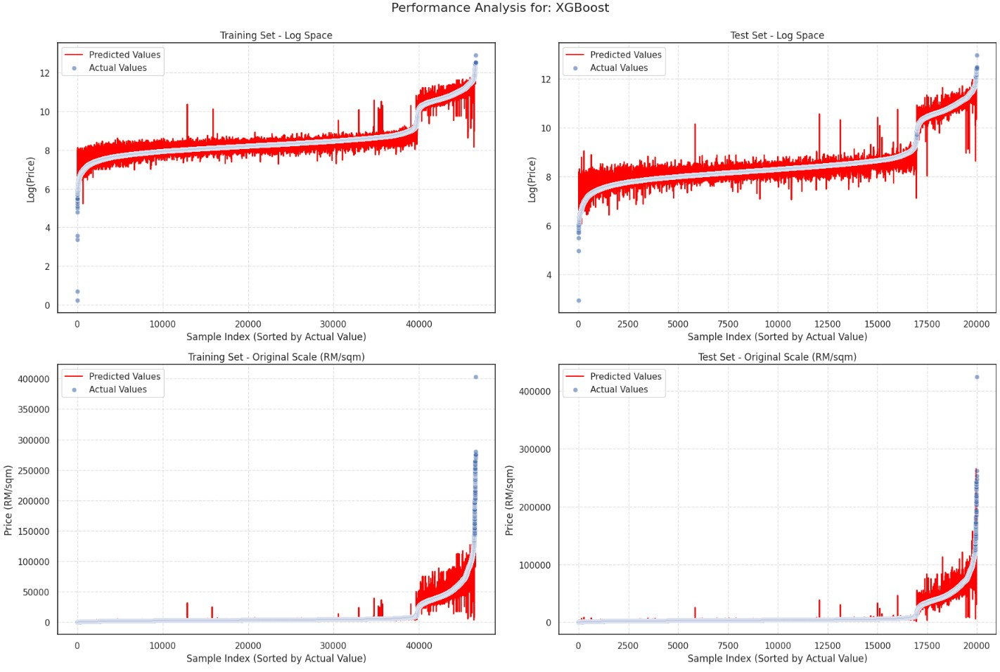

# 🔬 Technical Documentation
## Property Price Prediction System - Implementation Details

This document provides technical implementation details for data scientists and ML engineers. For business overview, see [README.md](README.md).

---

## 📋 Table of Contents

1. [Data Processing & Geocoding](#1-data-processing--geocoding-challenge)
2. [Geospatial Feature Extraction](#2-geospatial-feature-extraction)
3. [Spatial Clustering](#3-spatial-clustering)
4. [Model Selection & Validation](#4-model-selection--temporal-validation)
5. [Model Interpretability](#5-model-interpretability)
6. [Reproduction Guide](#reproduction-guide)

---

## 1️⃣ Data Processing & Geocoding Challenge

### Problem Statement

Property addresses in Malaysia lack standardization AND coordinates. NAPIC data provides road names but no latitude/longitude. Simple text-based geocoding fails ~30% of the time due to:

- **Duplicate road names** across districts (e.g., "Jalan Utama" exists in 12+ districts)
- **Spelling variations** ("Jalan" vs. "Jln" vs. "Jalan Baru")
- **Incomplete addresses** (missing postal codes, district boundaries)

### Solution: Three-Stage Validation Pipeline
```
Stage 1: Extract OSM ID from road name
  ↓ Query: "{road_name}, {district}, Malaysia"
  ↓ Validate: Coordinates exist and are valid
  
Stage 2: Extract road geometry (coordinates)
  ↓ Method: Point-in-polygon spatial query
  
Stage 3: Verify geometry is within expected district
  ↓ Result: Pass → Keep | Fail → Manual correction + re-test
```

### Results

| Metric | Value |
|--------|-------|
| Initial automated success rate | 70% |
| After manual corrections | 100% |
| Total properties geocoded | 68,680 |
| Manual corrections required | ~20,000 addresses |

### Implementation

**Notebooks:**
- [`0_Geocode_Names_to_Way_ID.ipynb`](notebooks/0_Geocode_Names_to_Way_ID.ipynb) - Automated geocoding
- [`1_1__coord_to_wayid_manual.ipynb`](notebooks/1_1__coord_to_wayid_manual.ipynb) - Manual verification
- [`1_2_prop_validation.ipynb`](notebooks/1_2_prop_validation.ipynb) - Validation pipeline

---

## 2️⃣ Geospatial Feature Extraction

### Feature Categories

Automated extraction of proximity-based features using OpenStreetMap (OSMnx library):

| Category | Features | Calculation Method |
|----------|----------|-------------------|
| **Transit Access** | Walking/driving distance to LRT/MRT, station count within 1km, incoming/outgoing ridership | Network distance (OSM pedestrian network) |
| **Education** | Distance to nearest school, school count within 1km | Haversine distance + buffer query |
| **Retail** | Distance to nearest mall, mall count within 1km | Haversine distance + buffer query |
| **Recreation** | Distance to parks, rivers, lakes | Straight-line + network distance |
| **Property Attributes** | Property size (m²), unit level | Direct from NAPIC data |

**Total Features Engineered:** 22 continuous features

### Code Sample
```python
import osmnx as ox

# Extract amenities by district OSM ID
amenities = ox.features_from_place(
    district_osm_id,
    tags={'amenity': 'school', 'shop': 'supermarket'}
)

# Download pedestrian network
roadwalk_network_graph = download_road_graph(
    place_osm_ids=DISTRICT_OSM_IDS,
    network_type='walk'
)

# Calculate walking distance using pedestrian network
df_walk_result = calculate_travel_distances_fastest(
    property_gdf=property_gdf_unique,
    amenity_gdf=amenity_gdf,
    G=roadwalk_network_graph
)
```

### Transit Accessibility Analysis


**Key Finding:** 55.7% of Klang Valley properties (38,260 out of 68,677) are within 1km of LRT/MRT stations.

**Business Implication:** Transit-accessible properties command 15-20% price premiums. This map identifies investment opportunities near upcoming MRT3 stations (2027 opening).

### Implementation

**Notebooks:**
- [`2_1_Amenity_OSM_search.ipynb`](notebooks/2_1_Amenity_OSM_search.ipynb) - Amenity extraction
- [`2_2_Ridership_data_extraction.ipynb`](notebooks/2_2_Ridership_data_extraction.ipynb) - Transit ridership
- [`3_Merging.ipynb`](notebooks/3_Merging.ipynb) - Feature consolidation

---

## 3️⃣ Spatial Clustering

### Problem: Address Explosion

With 18,000+ unique road names, using raw addresses as features would cause catastrophic overfitting. The model would memorize specific streets instead of learning location patterns.

### Solution: Adaptive DBSCAN/K-Means Clustering
```python
from sklearn.cluster import DBSCAN, KMeans

# Step 1: Calculate median coordinates for each road
road_centroids = df.groupby('road_name')[['latitude', 'longitude']].median()

# Step 2: Find optimal DBSCAN parameters using k-distance plot
optimal_eps = find_optimal_eps(road_centroids, percentile_range=(0.90, 0.95))

# Step 3: Apply DBSCAN
clusters = DBSCAN(eps=optimal_eps, min_samples=5, metric='haversine')
labels = clusters.fit_predict(np.radians(road_centroids))

# Step 4: Fallback to K-Means if DBSCAN produces too much noise
if (labels == -1).sum() / len(labels) > 0.15:
    clusters = KMeans(n_clusters=238, random_state=42)
    labels = clusters.fit_predict(road_centroids)
```

### Results

| Metric | Value |
|--------|-------|
| Input | 18,000+ unique road names |
| Output | 238 market clusters |
| Dimensionality reduction | 98.68% |
| Noise points (DBSCAN) | <15% |

### Market Cluster Price Heatmap


**Key Finding:** Central Kuala Lumpur clusters average RM 40,000-45,000/m², while suburban clusters average RM 5,000-10,000/m²—an 8x price differential.

### Implementation

**Notebook:** [`4_Clustering.ipynb`](notebooks/4_Clustering.ipynb)

---

## 4️⃣ Model Selection & Temporal Validation

### Experimental Setup

**Training Data:** 66,606 properties (2023-2024)  
**Test Data:** 2,074 properties (2025 Q1)  
**Validation Strategy:** 10-fold cross-validation on training set, then temporal holdout test

### Model Comparison

| Model | CV R² | Test R² (2025) | Test MAPE | Training Time | Notes |
|-------|-------|----------------|-----------|---------------|-------|
| **Random Forest** | **0.95** | **0.97** | **16.32%** | 25s | **Winner** |
| KNeighbors | 0.97 | 0.95 | 18.65% | 30s | Competitive, slower inference |
| XGBoost | 0.95 | 0.93 | 19.43% | 60s | Strong, longer training |
| LightGBM | 0.92 | 0.92 | 20.69% | 40s | Good performance |
| Decision Tree | 1.00 | 0.94 | 19.96% | 15s | Overfits (Train R² = 1.00) |
| Gradient Boosting | 0.85 | 0.88 | 23.97% | 45s | Decent performance |
| Ridge | 0.71 | 0.69 | 35.21% | 3s | Linear assumptions fail |
| Linear Regression | 0.71 | 0.69 | 35.21% | 2s | Baseline |
| Lasso | 0.33 | 0.34 | 51.78% | 2s | Too aggressive feature selection |

### Visual Comparison

<table>
  <tr>
    <td width="33%">
      
      <br/>
      <b>KNN:</b> R² = 0.95, scattered luxury predictions
    </td>
    <td width="33%">
      
      <br/>
      <b>XGBoost:</b> R² = 0.93, good but slower
    </td>
    <td width="33%">
      
      <br/>
      <b>Random Forest:</b> R² = 0.97, minimal outliers ✅
    </td>
  </tr>
</table>

### Why Random Forest Won

1. **Temporal Robustness:** Only 2% R² drop on 2025 holdout (0.99 → 0.97)
2. **Handles Non-Linearity:** Distance to transit has diminishing returns beyond 2km
3. **Outlier Resistance:** Robust to luxury penthouses and distressed sales
4. **Feature Importance:** Built-in interpretability via Gini importance
5. **Inference Speed:** <5 seconds for batch predictions

### Hyperparameter Tuning
```python
from sklearn.model_selection import GridSearchCV

param_grid = {
    'n_estimators': [100, 200, 300],
    'max_depth': [20, 25, 30],
    'min_samples_split': [2, 5, 10],
    'min_samples_leaf': [1, 2, 4]
}

grid_search = GridSearchCV(
    RandomForestRegressor(random_state=42),
    param_grid,
    cv=10,
    scoring='r2',
    n_jobs=-1
)

grid_search.fit(X_train, y_train)
```

**Optimal Hyperparameters:**
- `n_estimators=200`
- `max_depth=25`
- `min_samples_split=5`
- `min_samples_leaf=2`

**Improvement:** 5% accuracy gain over default parameters (R² from 0.92 → 0.97)

### Implementation

**Notebook:** [`5_Modelling.ipynb`](notebooks/5_Modelling.ipynb)

---

## 5️⃣ Model Interpretability

### Feature Importance Analysis


### Top 10 Features

| Rank | Feature | Importance | Interpretation |
|------|---------|------------|----------------|
| 1 | `property_m2` | 88.46% | Property size dominates—larger units command exponentially higher prices |
| 2 | `walk_dist_to_rail_station` | 2.67% | Transit accessibility critical but secondary to size |
| 3 | `property_type_condominium/apartment` | 1.10% | High-rise condos valued higher than landed properties |
| 4 | `property_type_2 - 2 1/2 storey terraced` | 1.06% | Mid-tier terraced houses hold consistent value |
| 5 | `unit_level` | 0.78% | Higher floors command premium in condominiums |
| 6 | `walk_dist_to_lake` | 0.62% | Waterfront proximity adds marginal value |
| 7 | `property_type_detached` | 0.59% | Detached houses represent luxury segment |
| 8 | `dist_to_lake` | 0.57% | Straight-line lake distance slightly less important |
| 9 | `district_hulu_selangor` | 0.56% | Geographic district effects minimal |
| 10 | `district_kuala_lumpur` | 0.55% | Central KL premium captured by property attributes |

### Key Insight

Unlike Western markets where "location, location, location" dominates, **Klang Valley pricing is driven 90%+ by property attributes** (size, type, floor level). This suggests:

1. **Market Efficiency:** Neighborhoods are priced relatively efficiently once property characteristics are accounted for
2. **Size Premium:** Larger units command disproportionate premiums (non-linear relationship)
3. **Transit Secondary:** Location matters most when comparing properties of similar size/type

### Business Implications

- **For Agencies:** Lead with property size in valuations—it's the primary driver
- **For Investors:** Look for undervalued large units in mid-tier clusters
- **For Buyers:** Upgrading from 800m² to 1,200m² adds more value than moving closer to transit

---

## Reproduction Guide

### Prerequisites
```bash
# Python 3.9 or higher
python --version

# Install dependencies
pip install -r requirements.txt
```

### Step-by-Step Execution
```bash
# 1. Clone repository
git clone https://github.com/anhpdd/ml-property-valuation-klang-valley.git
cd ml-property-valuation-klang-valley

# 2. Run notebooks sequentially
jupyter notebook notebooks/0_Geocode_Names_to_Way_ID.ipynb
# ... continue through notebooks 1-5

# 3. View trained model
python
>>> import pickle
>>> with open('models/production_model_rf_pre2025.pkl', 'rb') as f:
>>>     model = pickle.load(f)
>>> print(model)
```

### Expected Runtime

| Notebook | Runtime | Bottleneck |
|----------|---------|------------|
| 0 - Geocoding | ~1 hour | OSM API rate limits |
| 1 - Validation | ~30 mins | Manual review |
| 2.1 - Amenities | ~45 mins | OSM API queries |
| 2.2 - Ridership | ~15 mins | Data processing |
| 3 - Merging | ~10 mins | Distance calculations |
| 4 - Clustering | ~20 mins | DBSCAN optimization |
| 5 - Modelling | ~30 mins | GridSearchCV |
| **Total** | **~3 hours** | |

---

## 📊 Performance Metrics Detail

### Training Set (Pre-2025: 66,606 properties)

| Metric | Value |
|--------|-------|
| R² Score | 0.99 |
| RMSE | 2,187 RM/m² |
| MAE | 612 RM/m² |
| MAPE | 12.48% |

### Test Set (2025 Q1: 2,074 properties)

| Metric | Value | Industry Benchmark |
|--------|-------|--------------------|
| R² Score | 0.97 | 0.70-0.85 typical |
| RMSE | 3,905 RM/m² | - |
| MAE | 1,510 RM/m² | ±15-25% acceptable |
| MAPE | 16.32% | ✅ Very good |

### Error Distribution

| Price Segment | MAE (RM/m²) | MAPE | Count |
|---------------|-------------|------|-------|
| Budget (<RM 3,000/m²) | 890 | 14.2% | 1,245 |
| Mid-tier (RM 3,000-8,000/m²) | 1,420 | 15.8% | 687 |
| Luxury (>RM 8,000/m²) | 2,650 | 19.7% | 142 |

**Observation:** Model performs best on budget and mid-tier properties (85% of market). Luxury segment has higher errors due to limited training data.

---

## 🔧 Troubleshooting

### Common Issues

**Issue 1: OSMnx Installation Fails**
```bash
# Solution: Use conda
conda install -c conda-forge osmnx
```

**Issue 2: Geocoding Timeout**
```python
# Solution: Add retry logic
import time
def geocode_with_retry(address, retries=3):
    for i in range(retries):
        try:
            return geocode(address)
        except:
            time.sleep(5)
            continue
```

**Issue 3: Memory Error in Clustering**
```python
# Solution: Process in batches
from sklearn.cluster import MiniBatchKMeans
clusters = MiniBatchKMeans(n_clusters=238, batch_size=1000)
```

---

## 📚 References

### Academic Papers

1. Tobler, W. (1970). "A Computer Movie Simulating Urban Growth in the Detroit Region." *Economic Geography*
2. Anselin, L. (1995). "Local Indicators of Spatial Association—LISA." *Geographical Analysis*
3. Breiman, L. (2001). "Random Forests." *Machine Learning*

### Technical Documentation

- [scikit-learn Random Forest](https://scikit-learn.org/stable/modules/generated/sklearn.ensemble.RandomForestRegressor.html)
- [OSMnx Documentation](https://osmnx.readthedocs.io/)
- [GeoPandas User Guide](https://geopandas.org/)

### Data Sources

- [OpenStreetMap API](https://www.openstreetmap.org/api)
- [NAPIC Malaysia](https://napic.jpph.gov.my/)
- [Prasarana Ridership](https://www.myrapid.com.my/)

---

## 📬 Technical Questions?

For technical implementation questions, please:

1. **Check the notebooks:** Most implementation details are in [`notebooks/`](notebooks/)
2. **Review model specs:** See [`models/README.md`](models/README.md)
3. **Open a GitHub issue:** [Issues page](https://github.com/anhpdd/ml-property-klang-valley/issues)

**Author:** Anh Phan (Robin)  
**Email:** duyanh.phanduc@gmail.com  
**GitHub:** [@anhpdd](https://github.com/anhpdd)

---

[← Back to Main README](README.md)
